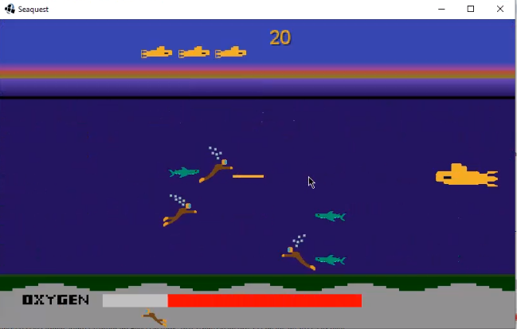
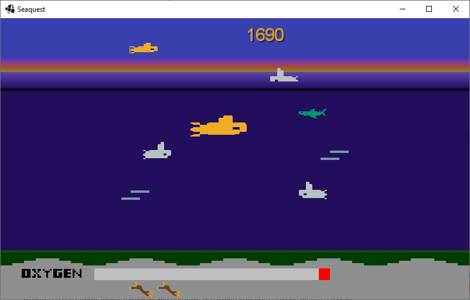
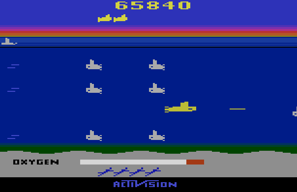

# SEAQUEST

  
  
  

---
## Description
- Remake of the Activision game Seaquest, from Atari 2600.
- In Java 15, using Object-Oriented Programming and the graphical library LibGDX.
- Practical work for the class LLP2 of informatics course in CEFET-MG.
- ALl the sprites were made from scratch.

---
## How to play
- The player controls a submarine and has to save divers, looking for treasures.
- Using the arrow keys to move and the space bar to shoot.

---
## Rules
- At the beginning, the player is above the water where the oxygen supply is refilled.
- The player has to dive in the water to save the divers, where his oxygen will decrease.
- Also, the player has to avoid or shoot the sharks and enemies subs.
- The submarine can carry up to 6 divers, and they must be saved every 6, the divers are saved when the sub emerges.
- If the player emerges with less than 6 divers, the player will lose a diver, and has to go back to get more until 6.
- If the player emerges with 0 divers, the player will lose a live.

### Oxygen Refill
- The oxygen supply is refilled when the player is above the water.
- The oxygen decreases when the player is underwater.
- If the player is partially submerged, the oxygen will be constant.

### Points
- Are only summed up when the player goes above the water.
- Enemy killed
- Diver saved

### Lives
- The player starts 3 lives.
- The player loses a live when:
  - Goes above the water with 0 divers.
  - Is hit by a shark, enemy sub, or shoot by enemy sub.
  - The oxygen runs out.

### Levels
- Every time the player goes to refill the oxygen, the speed of the anemies are increased, indefinitely.
- Patrols will start to appear as the player have rescued 2 sets of 6 divers.
- Every 10.000 points the player receives 1 extra live, up to 6 lives at a time.

---
## How to execute
- The final version of the game is ready to play in the ``Seaquest.jar`` file in the project root.

---
## Structure
- ### Folders
  - The project structure was divided into folders, as follows:
    - ``src``: the source code divided in the below packages.
      - ``ambiente``: classes related to the environment.
      - ``personagens``: classes related to the characters.
        - ``aliados``: classes related to the player and divers.
        - ``inimigos``: classes related to the enemies.
        - ``caracteristicas``: classes related to the characteristics the characters can have.
      - ``tiro``: classes of the shots.
      - ``rodar``: classes related to running the game.
    - ``sprites``: the sprites images of the game.
    - ``sounds``: the sounds of the game.
    - ``imgs``: the images used for documenting the game.

- ### Classes
  - The project structure was divided into classes, as follows:
    - ``Background``: encompasses the characteristics of the game's background and screen.
    - ``Ondas``: 'Waves', marks the upper region in the sea.
    - ``Submarino``: 'Submarine', represents the player.
    - ``Mergulhador``: 'Diver', the diver to be rescued.
    - ``Direcao``: 'Direction', enum with right and left, also has some utilities.
    - ``Inimigo``: 'Enemy', represents the generic part of every enemy.
      - ``SubmarinoInimigo``: 'Enemy Submarine', represents the enemy submarine.
      - ``Patrulha``: 'Patrol', represents the patrol submarine above the waves.
      - ``Tubarao``: 'Shark', represents the shark.
    - ``Tiro``: 'Shot', represents the shot.
      - ``TiroInimigo``: 'Enemy Shot', represents the shot of the enemy submarine.
      - ``TiroSubmarino``: 'Submarine Shot', represents the shot of the player.
    - ``Jogo``: 'Game', manages and store all the game components.
    - ``Seaquest``: comports the main to start a ``LwjglApplication`` calling the ``Jogo`` class.

---
## Requirements
- ### Java 15
  - https://www.oracle.com/java/technologies/javase/jdk15-archive-downloads.html
- ### LibGDX
  - https://libgdx.com
